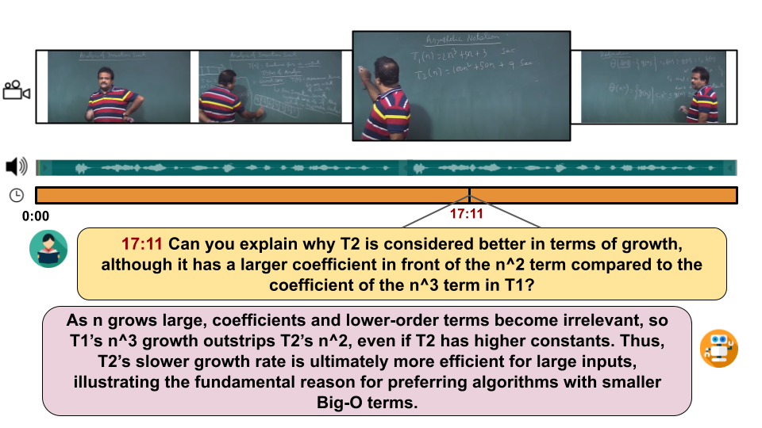

# EduVidQA: Generating and Evaluating Long-form Answers to Student Questions based on Lecture Videos

[](https://2025.emnlp.org/)
[](https://www.python.org/downloads/release/python-3100/)
[](LICENSE)

> **Official implementation** of the paper "EduVidQA: Generating and Evaluating Long-form Answers to Student Questions based on Lecture Videos" published at the EMNLP 2025 Main Conference as a long paper.

## 📖 Overview

EduVidQA is a benchmarking dataset for generating long-form answers to student questions based on lecture videos.



## 📁 Dataset

The dataset includes:
- **Synthetic train and test sets** - Automatically generated question-answer pairs
- **Real-world test set** - Human-curated questions from actual educational contexts

All data is available in the `data/` directory.

### Data Download Requirements

For video and transcript data, we recommend:
- **Videos**: [yt-dlp](https://github.com/yt-dlp/yt-dlp) - A robust YouTube video downloader
- **Transcripts**: [youtube-transcript-api](https://pypi.org/project/youtube-transcript-api/) - Python API for YouTube transcript extraction

## 🚀 Quick Start

### Environment Setup

1. **Create and activate conda environment**
   ```bash
   conda create -n eduvidqa python=3.10
   conda activate eduvidqa
   ```

2. **Install dependencies**
   ```bash
   cd evaluation/
   pip install -r requirements.txt
   ```

### Running Evaluation

1. **Prepare your data** in CSV format with columns: `question`, `answer`, `generated`
2. **Configure evaluation settings** in `config.json`
3. **Run evaluation**
   ```bash
   python evaluation.py
   ```

## ⚙️ Configuration

### Input Data Format

Your CSV file must contain the following columns:

| Column | Description |
|--------|-------------|
| `question` | The student question from the dataset |
| `answer` | The reference/ground truth answer |
| `generated` | The model-generated answer to evaluate |

**Example**: See `placeholder_file.csv` for format reference.

### Configuration File (`config.json`)

#### LLM Model Settings
```json
{
  "LLM model": {
    "model_to_use": "gpt-4o",
    "options": ["gpt-4o", "gemini-1.5"],
    "openai_api_key": "your-openai-api-key",
    "gemini_api_key": "your-gemini-api-key"
  }
}
```

#### Data Paths
```json
{
  "data paths": {
    "input_path": "placeholder_file.csv",
    "output_path": "results.json"
  }
}
```

#### Evaluation Metrics
```json
{
  "metric choices": {
    "entailment score": true,
    "factqa score": true,
    "clarity": true,
    "encouraging critical thinking": true,
    "using pedagogical techniques": true
  }
}
```

### Available Metrics

| Metric | Description | Reference |
|--------|-------------|-----------|
| **Entailment Score** | Measures logical consistency between generated and reference answers | [arXiv:2410.06420](https://arxiv.org/abs/2410.06420) |
| **FactQA Score** | Assesses factual correctness of generated answers | [arXiv:2403.14666](https://arxiv.org/abs/2403.14666) |
| **Clarity** | Evaluates clear and effective communication |  |
| **Critical Thinking** | Checks if answers promote thoughtful reasoning |  |
| **Pedagogical Techniques** | Detects educational/teaching strategies |  |

## Benchmarking Details

We evaluated EduVidQA across various state-of-the-art models:

### Video Large Language Models (Video LLMs)
| Model | Parameters | Paper | Code |
|-------|------------|-------|------|
| mPLUG-Owl3 | 8B | [arXiv:2408.04840](https://arxiv.org/abs/2408.04840) | [GitHub](https://github.com/X-PLUG/mPLUG-Owl/tree/main/mPLUG-Owl3) |
| Video-LlaVA | 7B | [arXiv:2311.10122](https://arxiv.org/abs/2311.10122) | [GitHub](https://github.com/PKU-YuanGroup/Video-LLaVA) |

### Large Vision Language Models (LVLMs)
| Model | Parameters | Paper | Code |
|-------|------------|-------|---------|
| Qwen2VL | 7B | [arXiv:2409.12191](https://arxiv.org/abs/2409.12191) | [GitHub](https://github.com/xwjim/Qwen2-VL) |
| LLaVA-1.5 | 13B | [arXiv:2310.03744](https://arxiv.org/abs/2310.03744) | [HuggingFace](https://huggingface.co/liuhaotian/llava-v1.5-13b) |
| Gemini-1.5 | - | [arXiv:2403.05530](https://arxiv.org/abs/2403.05530) | [API](https://ai.google.dev/gemini-api/docs/quickstart) |
| GPT-4o | - | [System Card](https://arxiv.org/abs/2410.21276) | [API](https://github.com/openai/openai-python) |

### Experimental Configuration

| Parameter | Value |
|-----------|-------|
| **Context Window** | 14 frames before + 15 frames after (Video LLMs) |
| **Transcript Window** | 4 minutes around timestamp |
| **Training Epochs** | 10 (with early stopping) |
| **LoRA Rank** | 64 |
| **Precision** | bfloat16 |
| **Max Token Length** | 256 |
| **Learning Rate** | 2e-5 (LLaVA), 1e-5 (others) |
| **Hardware** | 2 × NVIDIA L40 GPUs |

## ⚠️ Important Notes

- **API Keys**: Ensure valid API keys are provided for your chosen model
- **Metric Selection**: At least one evaluation metric must be enabled
- **File Paths**: Verify all paths are correct and accessible
- **Python Version**: Requires Python 3.10 or higher


## 📜 License

This project is licensed under the MIT License.

## 🤝 Contributing

We welcome contributions! Please feel free to submit issues, feature requests, or pull requests.

## 📧 Contact

For questions or support, please [open an issue](../../issues) or contact the authors.

---
